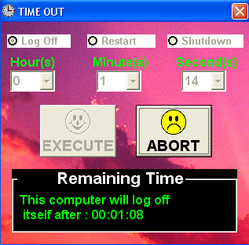



## A Log Off, Restart, Shutdown Timer

### Description

For logging off, restarting and shutting down the computer.

Reminder : Please if you see an error on this program just leave a comment.
 
### More Info
 

             |
---                |---
**Submitted On**   |2008-07-03 08:16:02
**By**             |[John Paul Pineda](https://github.com/Planet-Source-Code/PSCIndex/blob/master/ByAuthor/john-paul-pineda.md)
**Level**          |Intermediate
**User Rating**    |3.0 (12 globes from 4 users)
**Compatibility**  |VB 6\.0
**Category**       |[Complete Applications](https://github.com/Planet-Source-Code/PSCIndex/blob/master/ByCategory/complete-applications__1-27.md)
**World**          |[Visual Basic](https://github.com/Planet-Source-Code/PSCIndex/blob/master/ByWorld/visual-basic.md)
**Archive File**   |[A\_Log\_Off\_211961772008\.zip](https://github.com/Planet-Source-Code/john-paul-pineda-a-log-off-restart-shutdown-timer__1-70791/archive/master.zip)

